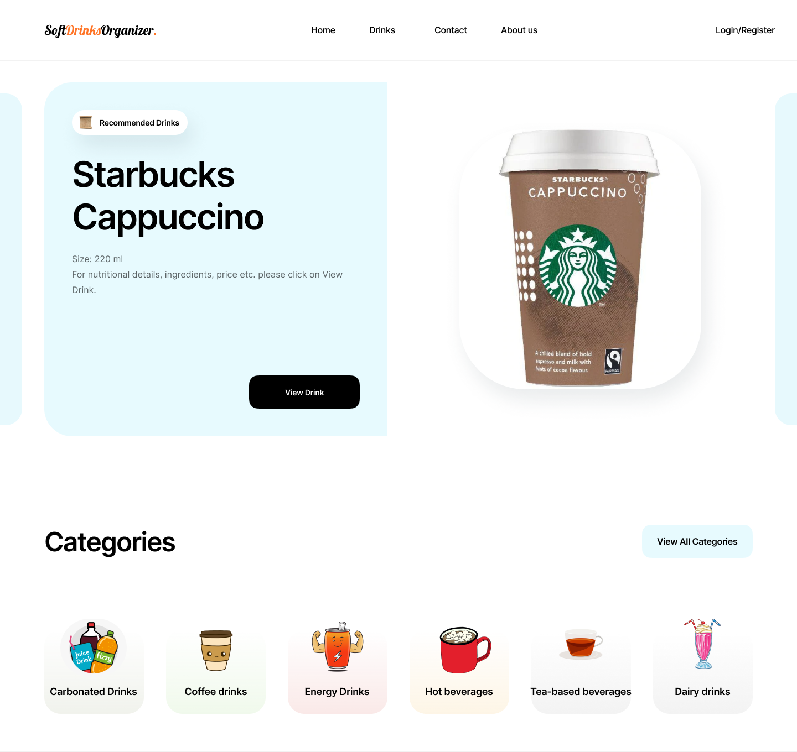

# Soft Drinks Organizer (SoDrO)🥤🍵🥛🍹

**SoftDrinksOrganizer** is a helpful website for soft drink lovers. We are your digital _encyclopedia_ on soft drinks.  You can discover a lot of great drinks sold on the entire globe. You can study their _ingredients_, _nutritional values_ and if you really like them you can add to your _shopping list_. Based on your activity we will try to give you the _best recommendation_.
## Overview

**SoDrO**  web application that manages the preferences of a person regarding the consumption of non-alcoholic drinks (teas, dairy products, juices, syrups, etc.). The application allows users to view, add, modify and delete drinks from the database, as well as to filter drinks by category, price, ingredients, images and availability according to the geographical region. 

The application also provides support for creating shopping lists, managing users and generating various statistics that can be exported in open formats, CSV and PDF. The application also creates an RSS data feed based on website changes like a new drink was added, a new drink is in top views. Furthermore an RSS news feed is feeded to the main page of the website to provide to the viewer the freshest news about soft drinks. This news articles are updated constantly.

For populating the database, the data available freely at [Open Food Facts](https://world.openfoodfacts.org/) are used.

## Features

Some of the most noticeable features of the **SoDrO** are:

- **MVC Architecture:** The application follows the MVC (Model-View-Controller) architecture, ensuring efficient development and maintenance.
- **Object-Oriented Programming Paradigms:** The application adheres to the principles of object-oriented programming, enhancing code readability and maintainability.
- **Responsive Design:** The design is responsive and compatible with all devices, including desktops, tablets, and mobile phones.
- **Admin Module:** The admin module allows for managing users, drinks, RSS feeds, accessing detailed statistics about website traffic and products, and managing newsletters.
- **Advanced Product Search and Filtering:** Users can search for products and apply advanced filters for a better browsing experience.
- **RSS Feed Integration:** The application integrates an RSS feed for updates and fetches news articles about soft drinks from external sources.
- **Shopping List and Stats:** Logged-in users can manage their shopping list, view product stats, and export details about products and their shopping list.
- **Validated HTML and CSS:** The application uses validated HTML and CSS files to ensure compliance with web standards and best practices.
- **User Authentication and Session Management:** Users can create and manage their accounts, securely log in/out, and have personalized sessions.
- **Administrator Control:** Administrators can modify the database by adding, deleting, and modifying products/users.
- **Ranking System:** The application features a ranking system that showcases the most popular products based on views and user preferences.
- **AJAX Integration:** The application uses AJAX for creating interactive web applications, improving the speed, performance, and usability.

## Tools & Technologies

This project is developed using the following technologies (***no frameworks were used***):

- **HTML**, **CSS** and **JavaScript** for the frontend.

- **PHP** and **MySQL** for the backend.

  
  
  
- [**Chart.js**](https://www.chartjs.org/) for generating charts.
  
  
  
- **XAMPP** and **phpMyAdmin** for creating a local web server and managing the MySQL database.

  
  
    
- [**InfinityFree**](https://www.infinityfree.com/) for hosting the web application online.

  

## Security

Implementarea va recurge la tehnici de prevenire a atacurilor (precum Cross Site Scripting sau SQL injection).

## Hosting

[Insert information about the hosting provider used for your project here]

## License

[Insert license information for your project here]

\
\
Design: https://www.figma.com/file/EPPpcE64S6aG270jEM1J7f/Soft-Drinks-Organizer?node-id=101%3A205 \
\
Documentatie: https://ionuttabalae.github.io/Soft-Drinks-Organizer/
